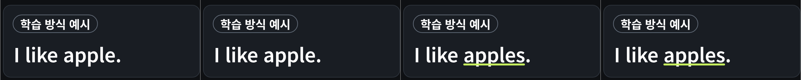
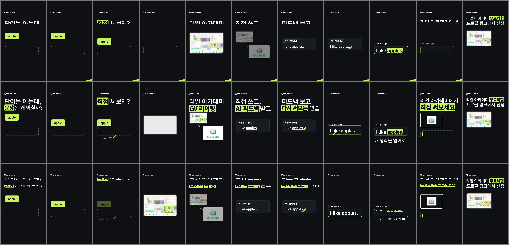
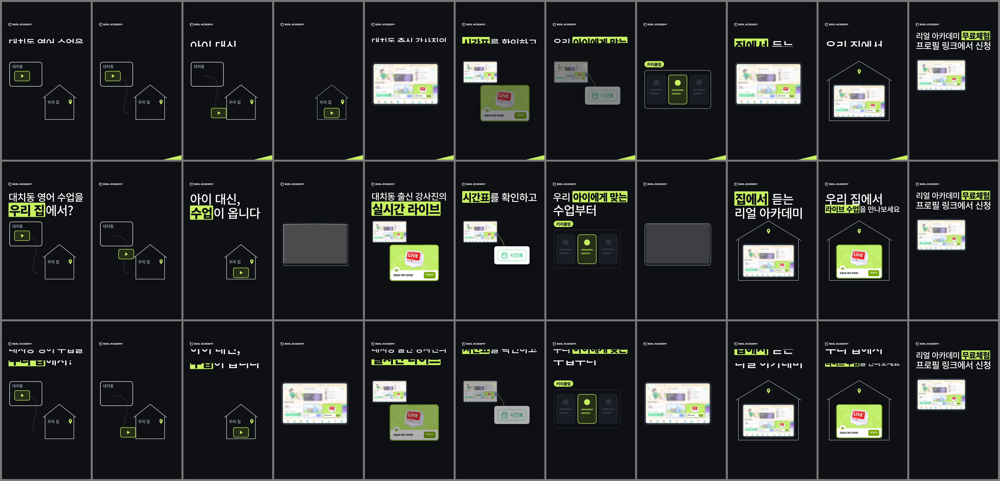
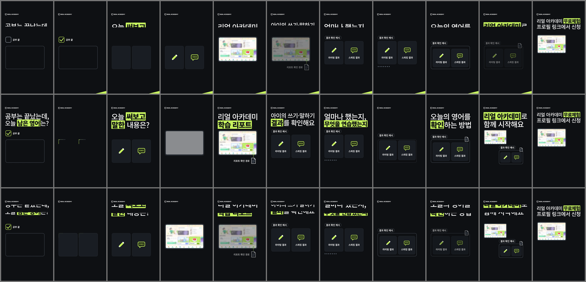

# 검수 결과 (자동 자가 검수)

- 실패 항목: **0건**

> 수치는 `scripts/validate.py`가 실제 파일(ffprobe/ffmpeg 디코드, 렌더 원본 프레임 MD5, 브라우저 DOM 측정, WAV 분석)에서 계산한 값입니다.
> 학부모 이해도·시청 유지율·상담 성과는 실측 전이므로 **미검증**입니다.

## A06 예시 상태 (8.4~13.6초)

| 프레임 | 초 | 보이는 예시 문장 | 학습 방식 예시 표기 |
|---|---|---|---|
| 257 | 8.567 | I like apple. | 예 |
| 258 | 8.6 | I like apple. | 예 |
| 323 | 10.767 | I like apple. | 예 |
| 324 | 10.8 | I like apples. | 예 |
| 329 | 10.967 | I like apples. | 예 |
| 330 | 11.0 | I like apples. | 예 |
| 404 | 13.467 | I like apples. | 예 |
| 405 | 13.5 | I like apples. | 예 |

- 문장 시작 좌표: 258f (134, 1030) / 330f (134, 1030) — 동일. 폭 442.5 → 480.7px (s 한 글자분만 증가)
- 258~323 (66f/2.2s) 'I like apple.' 정지, 324~329 s 추가·밑줄, 330~404 (75f/2.5s) 'I like apples.' 정지 — 아래 A편 정지 표에서 원본·디코드 모두 동일 프레임 확인

## A편

| 항목 | A.mp4 | A-silent.mp4 |
|---|---|---|
| 해상도 | 1080×1920 | 1080×1920 |
| fps (r/avg) | 30/1 / 30/1 | 30/1 / 30/1 |
| 디코드 프레임 수 | 900 | 900 |
| 비디오 길이 | 30.000s | 30.000s |
| 컨테이너 길이 | 30.000s | 30.000s |
| 오디오 | aac 48000Hz 2ch 30.000s | 없음(무음본) |
| 디코드 오류 | none | none |

- 컷: 11개, 합계 900프레임, 누락/겹침 0
- 글리프 누락: 없음
- 디코드된 CTA(780~899) 고유 프레임 MD5 수: 1 (1 = 120프레임 완전 정지)
- 디코드 프레임 정렬(PSNR, 원본 PNG 대비): f42=45.26dB, f132=44.87dB, f219=43.06dB, f462=44.65dB, f609=45.88dB, f840=43.73dB, f324=44.47dB, f330=38.48dB

### 주 카피 시간 (엔진 프레임 상태 집계)

| 컷 | 등장 | 정지 | 퇴장 |
|---|---|---|---|
| A01 | 6f (0.2s) | 75f (2.5s) | 3f (0.1s) |
| A02 | 새 문구 없음 | | |
| A03 | 6f (0.2s) | 39f (1.3s) | 3f (0.1s) |
| A04 | 새 문구 없음 | | |
| A05 | 6f (0.2s) | 57f (1.9s) | 3f (0.1s) |
| A06 | 6f (0.2s) | 147f (4.9s) | 3f (0.1s) |
| A07 | 6f (0.2s) | 99f (3.3s) | 3f (0.1s) |
| A08 | 새 문구 없음 | | |
| A09 | 6f (0.2s) | 129f (4.3s) | 3f (0.1s) |
| A10 | 6f (0.2s) | 93f (3.1s) | 3f (0.1s) |
| A11 | 0f (0.0s) | 120f (4.0s) | 0f (0.0s) |

### 장면 정지 구간 (렌더 원본 PNG MD5 동일 여부 + 디코드 MD5)

| 컷 | 대상 | 프레임 | 길이 | 원본 동일 | 디코드 고유 MD5 | 마지막 프레임 PSNR(디코드 vs 원본) |
|---|---|---|---|---|---|---|
| A02 | apple 블록 멈춤 | 96..107 | 12f / 0.4s | 예 | 1 | 47.59 dB |
| A06 | I like apple. | 258..323 | 66f / 2.2s | 예 | 1 | 44.5 dB |
| A06 | I like apples. | 330..404 | 75f / 2.5s | 예 | 1 | 38.48 dB |
| A11 | CTA 전체 화면 | 780..899 | 120f / 4.0s | 예 | 1 | 43.73 dB |

### 카피·보조 문자열 (각 컷 시작/중앙/마지막 프레임)

| 컷 | 프레임 | 보이는 문자열 | 카피 크기(1080 / 360폭) | 문제 |
|---|---|---|---|---|
| A01 | 0 (start) | apple · 단어는 아는데, · 문장은 왜 막힐까? |  | 없음 |
| A01 | 42 (mid) | apple · 단어는 아는데, · 문장은 왜 막힐까? | 150/125px / 50.0/41.7px | 없음 |
| A01 | 83 (last) | apple · 단어는 아는데, · 문장은 왜 막힐까? |  | 없음 |
| A02 | 84 (start) | apple |  | 없음 |
| A02 | 96 (mid) | apple |  | 없음 |
| A02 | 107 (last) | apple |  | 없음 |
| A03 | 108 (start) | apple · 직접 써보면? |  | 없음 |
| A03 | 132 (mid) | apple · 직접 써보면? | 150px / 50.0px | 없음 |
| A03 | 155 (last) | apple · 직접 써보면? |  | 없음 |
| A04 | 156 (start) |  |  | 없음 |
| A04 | 171 (mid) |  |  | 없음 |
| A04 | 185 (last) |  |  | 없음 |
| A05 | 186 (start) | GV 라이팅 · 리얼 아카데미 |  | 없음 |
| A05 | 219 (mid) | GV 라이팅 · 리얼 아카데미 | 150/150px / 50.0/50.0px | 없음 |
| A05 | 251 (last) | GV 라이팅 · 리얼 아카데미 |  | 없음 |
| A06 | 252 (start) | AI 피드백받고 · GV 라이팅 · 직접 쓰고, |  | 없음 |
| A06 | 330 (mid) | AI 피드백받고 · I like apples. · 직접 쓰고, · 학습 방식 예시 | 150/150px / 50.0/50.0px | 없음 |
| A06 | 407 (last) | AI 피드백받고 · I like apples. · 직접 쓰고, · 학습 방식 예시 |  | 없음 |
| A07 | 408 (start) | I like apples. · 다시 써보는 연습 · 피드백 보고 · 학습 방식 예시 |  | 없음 |
| A07 | 462 (mid) | I like apples. · 다시 써보는 연습 · 피드백 보고 · 학습 방식 예시 | 150/134px / 50.0/44.7px | 없음 |
| A07 | 515 (last) | I like apples. · 다시 써보는 연습 · 피드백 보고 · 학습 방식 예시 |  | 없음 |
| A08 | 516 (start) | I like apples. · 학습 방식 예시 |  | 없음 |
| A08 | 528 (mid) | I like apples. · 학습 방식 예시 |  | 없음 |
| A08 | 539 (last) | I like apples. · 학습 방식 예시 |  | 없음 |
| A09 | 540 (start) | I like apples. · 내 생각을 영어로 · 학습 방식 예시 |  | 없음 |
| A09 | 609 (mid) | I like apples. · 내 생각을 영어로 · 학습 방식 예시 | 112/112px / 37.3/37.3px | 없음 |
| A09 | 677 (last) | I like apples. · 내 생각을 영어로 · 학습 방식 예시 |  | 없음 |
| A10 | 678 (start) | 리얼 아카데미에서 · 직접 써보세요 · 학습 방식 예시 |  | 없음 |
| A10 | 729 (mid) | 리얼 아카데미에서 · 직접 써보세요 | 124/150px / 41.3/50.0px | 없음 |
| A10 | 779 (last) | 리얼 아카데미에서 · 직접 써보세요 |  | 없음 |
| A11 | 780 (start) | 리얼 아카데미 무료체험 · 프로필 링크에서 신청 |  | 없음 |
| A11 | 840 (mid) | 리얼 아카데미 무료체험 · 프로필 링크에서 신청 | 96/108px / 32.0/36.0px | 없음 |
| A11 | 899 (last) | 리얼 아카데미 무료체험 · 프로필 링크에서 신청 |  | 없음 |

### 오디오 (코드 합성 임시 음원)

- 통합 라우드니스 -16.1 LUFS, 피크 -1.9 dB, BPM 116
- BGM 덕킹: 8.4~13.6s 목표 -6.0dB → 측정 -6.0dB
- 끝 페이드: 마지막 50ms RMS가 29.0~29.4s 대비 -29.9dB
- 26초 이후 시작하는 효과음: 0개 (26.0초 확인음 1회만 허용)

## B편

| 항목 | B.mp4 | B-silent.mp4 |
|---|---|---|
| 해상도 | 1080×1920 | 1080×1920 |
| fps (r/avg) | 30/1 / 30/1 | 30/1 / 30/1 |
| 디코드 프레임 수 | 900 | 900 |
| 비디오 길이 | 30.000s | 30.000s |
| 컨테이너 길이 | 30.000s | 30.000s |
| 오디오 | aac 48000Hz 2ch 30.000s | 없음(무음본) |
| 디코드 오류 | none | none |

- 컷: 11개, 합계 900프레임, 누락/겹침 0
- 글리프 누락: 없음
- 디코드된 CTA(780~899) 고유 프레임 MD5 수: 1 (1 = 120프레임 완전 정지)
- 디코드 프레임 정렬(PSNR, 원본 PNG 대비): f39=44.2dB, f132=45.2dB, f267=41.61dB, f471=42.14dB, f618=43.72dB, f840=43.73dB

### 주 카피 시간 (엔진 프레임 상태 집계)

| 컷 | 등장 | 정지 | 퇴장 |
|---|---|---|---|
| B01 | 6f (0.2s) | 69f (2.3s) | 3f (0.1s) |
| B02 | 새 문구 없음 | | |
| B03 | 6f (0.2s) | 51f (1.7s) | 3f (0.1s) |
| B04 | 새 문구 없음 | | |
| B05 | 6f (0.2s) | 153f (5.1s) | 3f (0.1s) |
| B06 | 6f (0.2s) | 57f (1.9s) | 3f (0.1s) |
| B07 | 6f (0.2s) | 105f (3.5s) | 3f (0.1s) |
| B08 | 새 문구 없음 | | |
| B09 | 6f (0.2s) | 123f (4.1s) | 3f (0.1s) |
| B10 | 6f (0.2s) | 87f (2.9s) | 3f (0.1s) |
| B11 | 0f (0.0s) | 120f (4.0s) | 0f (0.0s) |

### 장면 정지 구간 (렌더 원본 PNG MD5 동일 여부 + 디코드 MD5)

| 컷 | 대상 | 프레임 | 길이 | 원본 동일 | 디코드 고유 MD5 | 마지막 프레임 PSNR(디코드 vs 원본) |
|---|---|---|---|---|---|---|
| B05 | 오늘의 대치 라이브 카드 | 204..344 | 141f / 4.7s | 예 | 1 | 41.61 dB |
| B06 | 시간표 버튼 크롭 | 354..410 | 57f / 1.9s | 예 | 1 | 38.47 dB |
| B11 | CTA 전체 화면 | 780..899 | 120f / 4.0s | 예 | 1 | 43.73 dB |

### 카피·보조 문자열 (각 컷 시작/중앙/마지막 프레임)

| 컷 | 프레임 | 보이는 문자열 | 카피 크기(1080 / 360폭) | 문제 |
|---|---|---|---|---|
| B01 | 0 (start) | 대치동 · 대치동 영어 수업을 · 우리 집 · 우리 집에서? |  | 없음 |
| B01 | 39 (mid) | 대치동 · 대치동 영어 수업을 · 우리 집 · 우리 집에서? | 120/150px / 40.0/50.0px | 없음 |
| B01 | 77 (last) | 대치동 · 대치동 영어 수업을 · 우리 집 · 우리 집에서? |  | 없음 |
| B02 | 78 (start) | 대치동 · 우리 집 |  | 없음 |
| B02 | 90 (mid) | 대치동 · 우리 집 |  | 없음 |
| B02 | 101 (last) | 대치동 · 우리 집 |  | 없음 |
| B03 | 102 (start) | 대치동 · 수업이 옵니다 · 아이 대신, · 우리 집 |  | 없음 |
| B03 | 132 (mid) | 수업이 옵니다 · 아이 대신, · 우리 집 | 150/150px / 50.0/50.0px | 없음 |
| B03 | 161 (last) | 수업이 옵니다 · 아이 대신, · 우리 집 |  | 없음 |
| B04 | 162 (start) | 우리 집 |  | 없음 |
| B04 | 174 (mid) |  |  | 없음 |
| B04 | 185 (last) |  |  | 없음 |
| B05 | 186 (start) | 대치동 출신 강사진의 · 실시간 라이브 |  | 없음 |
| B05 | 267 (mid) | 대치동 출신 강사진의 · 실시간 라이브 · 오늘의 대치 라이브 | 108/150px / 36.0/50.0px | 없음 |
| B05 | 347 (last) | 대치동 출신 강사진의 · 실시간 라이브 · 오늘의 대치 라이브 |  | 없음 |
| B06 | 348 (start) | 시간표를 확인하고 · 오늘의 대치 라이브 |  | 없음 |
| B06 | 381 (mid) | 시간표 · 시간표를 확인하고 | 122px / 40.7px | 없음 |
| B06 | 413 (last) | 시간표 · 시간표를 확인하고 |  | 없음 |
| B07 | 414 (start) | 수업부터 · 시간표 · 우리 아이에게 맞는 |  | 없음 |
| B07 | 471 (mid) | 수업부터 · 우리 아이에게 맞는 · 커리큘럼 | 119/150px / 39.7/50.0px | 없음 |
| B07 | 527 (last) | 수업부터 · 우리 아이에게 맞는 · 커리큘럼 |  | 없음 |
| B08 | 528 (start) | 커리큘럼 |  | 없음 |
| B08 | 540 (mid) |  |  | 없음 |
| B08 | 551 (last) |  |  | 없음 |
| B09 | 552 (start) | 리얼 아카데미 · 집에서 듣는 |  | 없음 |
| B09 | 618 (mid) | 리얼 아카데미 · 집에서 듣는 | 150/150px / 50.0/50.0px | 없음 |
| B09 | 683 (last) | 리얼 아카데미 · 집에서 듣는 |  | 없음 |
| B10 | 684 (start) | 라이브 수업을 만나보세요 · 우리 집에서 |  | 없음 |
| B10 | 732 (mid) | 라이브 수업을 만나보세요 · 오늘의 대치 라이브 · 우리 집에서 | 150/88px / 50.0/29.3px | 없음 |
| B10 | 779 (last) | 라이브 수업을 만나보세요 · 오늘의 대치 라이브 · 우리 집에서 |  | 없음 |
| B11 | 780 (start) | 리얼 아카데미 무료체험 · 프로필 링크에서 신청 |  | 없음 |
| B11 | 840 (mid) | 리얼 아카데미 무료체험 · 프로필 링크에서 신청 | 96/108px / 32.0/36.0px | 없음 |
| B11 | 899 (last) | 리얼 아카데미 무료체험 · 프로필 링크에서 신청 |  | 없음 |

### 오디오 (코드 합성 임시 음원)

- 통합 라우드니스 -16.2 LUFS, 피크 -1.7 dB, BPM 108
- BGM 덕킹: 6.2~11.6s 목표 -6.0dB → 측정 -6.0dB
- 끝 페이드: 마지막 50ms RMS가 29.0~29.4s 대비 -29.2dB
- 26초 이후 시작하는 효과음: 0개 (26.0초 확인음 1회만 허용)

## C편

| 항목 | C.mp4 | C-silent.mp4 |
|---|---|---|
| 해상도 | 1080×1920 | 1080×1920 |
| fps (r/avg) | 30/1 / 30/1 | 30/1 / 30/1 |
| 디코드 프레임 수 | 900 | 900 |
| 비디오 길이 | 30.000s | 30.000s |
| 컨테이너 길이 | 30.000s | 30.000s |
| 오디오 | aac 48000Hz 2ch 30.000s | 없음(무음본) |
| 디코드 오류 | none | none |

- 컷: 11개, 합계 900프레임, 누락/겹침 0
- 글리프 누락: 없음
- 디코드된 CTA(780~899) 고유 프레임 MD5 수: 1 (1 = 120프레임 완전 정지)
- 디코드 프레임 정렬(PSNR, 원본 PNG 대비): f42=43.96dB, f141=42.95dB, f243=42.28dB, f495=41.8dB, f636=45.86dB, f840=43.73dB

### 주 카피 시간 (엔진 프레임 상태 집계)

| 컷 | 등장 | 정지 | 퇴장 |
|---|---|---|---|
| C01 | 6f (0.2s) | 75f (2.5s) | 3f (0.1s) |
| C02 | 새 문구 없음 | | |
| C03 | 6f (0.2s) | 57f (1.9s) | 3f (0.1s) |
| C04 | 새 문구 없음 | | |
| C05 | 6f (0.2s) | 81f (2.7s) | 3f (0.1s) |
| C06 | 6f (0.2s) | 147f (4.9s) | 3f (0.1s) |
| C07 | 6f (0.2s) | 93f (3.1s) | 3f (0.1s) |
| C08 | 새 문구 없음 | | |
| C09 | 6f (0.2s) | 123f (4.1s) | 3f (0.1s) |
| C10 | 6f (0.2s) | 69f (2.3s) | 3f (0.1s) |
| C11 | 0f (0.0s) | 120f (4.0s) | 0f (0.0s) |

### 장면 정지 구간 (렌더 원본 PNG MD5 동일 여부 + 디코드 MD5)

| 컷 | 대상 | 프레임 | 길이 | 원본 동일 | 디코드 고유 MD5 | 마지막 프레임 PSNR(디코드 vs 원본) |
|---|---|---|---|---|---|---|
| C06 | 두 결과 카드 | 300..440 | 141f / 4.7s | 예 | 1 | 45.65 dB |
| C11 | CTA 전체 화면 | 780..899 | 120f / 4.0s | 예 | 1 | 43.73 dB |

### 카피·보조 문자열 (각 컷 시작/중앙/마지막 프레임)

| 컷 | 프레임 | 보이는 문자열 | 카피 크기(1080 / 360폭) | 문제 |
|---|---|---|---|---|
| C01 | 0 (start) | 공부 끝 · 공부는 끝났는데, · 오늘 남은 영어는? |  | 없음 |
| C01 | 42 (mid) | 공부 끝 · 공부는 끝났는데, · 오늘 남은 영어는? | 136/125px / 45.3/41.7px | 없음 |
| C01 | 83 (last) | 공부 끝 · 공부는 끝났는데, · 오늘 남은 영어는? |  | 없음 |
| C02 | 84 (start) | 공부 끝 |  | 없음 |
| C02 | 96 (mid) |  |  | 없음 |
| C02 | 107 (last) |  |  | 없음 |
| C03 | 108 (start) | 말한 내용은? · 오늘 써보고 |  | 없음 |
| C03 | 141 (mid) | 말한 내용은? · 오늘 써보고 | 150/150px / 50.0/50.0px | 없음 |
| C03 | 173 (last) | 말한 내용은? · 오늘 써보고 |  | 없음 |
| C04 | 174 (start) |  |  | 없음 |
| C04 | 186 (mid) |  |  | 없음 |
| C04 | 197 (last) |  |  | 없음 |
| C05 | 198 (start) | 리얼 아카데미 · 학습 리포트 |  | 없음 |
| C05 | 243 (mid) | 리얼 아카데미 · 리포트 확인 경로 · 학습 리포트 | 150/150px / 50.0/50.0px | 없음 |
| C05 | 287 (last) | 리얼 아카데미 · 리포트 확인 경로 · 학습 리포트 |  | 없음 |
| C06 | 288 (start) | 결과를 확인해요 · 리포트 확인 경로 · 아이의 쓰기·말하기 |  | 없음 |
| C06 | 366 (mid) | 결과 확인 예시 · 결과를 확인해요 · 라이팅 결과 · 스피킹 결과 · 아이의 쓰기·말하기 | 120/138px / 40.0/46.0px | 없음 |
| C06 | 443 (last) | 결과 확인 예시 · 결과를 확인해요 · 라이팅 결과 · 스피킹 결과 · 아이의 쓰기·말하기 |  | 없음 |
| C07 | 444 (start) | 결과 확인 예시 · 라이팅 결과 · 무엇을 연습했는지 · 스피킹 결과 · 얼마나 했는지, |  | 없음 |
| C07 | 495 (mid) | 결과 확인 예시 · 라이팅 결과 · 무엇을 연습했는지 · 스피킹 결과 · 얼마나 했는지, | 150/123px / 50.0/41.0px | 없음 |
| C07 | 545 (last) | 결과 확인 예시 · 라이팅 결과 · 무엇을 연습했는지 · 스피킹 결과 · 얼마나 했는지, |  | 없음 |
| C08 | 546 (start) | 결과 확인 예시 · 라이팅 결과 · 스피킹 결과 |  | 없음 |
| C08 | 558 (mid) | 결과 확인 예시 · 라이팅 결과 · 스피킹 결과 |  | 없음 |
| C08 | 569 (last) | 결과 확인 예시 · 라이팅 결과 · 스피킹 결과 |  | 없음 |
| C09 | 570 (start) | 결과 확인 예시 · 라이팅 결과 · 스피킹 결과 · 오늘의 영어를 · 확인하는 방법 |  | 없음 |
| C09 | 636 (mid) | 결과 확인 예시 · 라이팅 결과 · 스피킹 결과 · 오늘의 영어를 · 확인하는 방법 | 150/150px / 50.0/50.0px | 없음 |
| C09 | 701 (last) | 결과 확인 예시 · 라이팅 결과 · 스피킹 결과 · 오늘의 영어를 · 확인하는 방법 |  | 없음 |
| C10 | 702 (start) | 결과 확인 예시 · 라이팅 결과 · 리얼 아카데미로 · 스피킹 결과 · 함께 시작해요 |  | 없음 |
| C10 | 741 (mid) | 결과 확인 예시 · 리얼 아카데미로 · 함께 시작해요 | 139/150px / 46.3/50.0px | 없음 |
| C10 | 779 (last) | 결과 확인 예시 · 리얼 아카데미로 · 함께 시작해요 |  | 없음 |
| C11 | 780 (start) | 리얼 아카데미 무료체험 · 프로필 링크에서 신청 |  | 없음 |
| C11 | 840 (mid) | 리얼 아카데미 무료체험 · 프로필 링크에서 신청 | 96/108px / 32.0/36.0px | 없음 |
| C11 | 899 (last) | 리얼 아카데미 무료체험 · 프로필 링크에서 신청 |  | 없음 |

### 오디오 (코드 합성 임시 음원)

- 통합 라우드니스 -16.0 LUFS, 피크 -2.2 dB, BPM 100
- BGM 덕킹: 9.6~14.8s 목표 -6.0dB → 측정 -6.0dB
- 끝 페이드: 마지막 50ms RMS가 29.0~29.4s 대비 -27.1dB
- 26초 이후 시작하는 효과음: 0개 (26.0초 확인음 1회만 허용)

