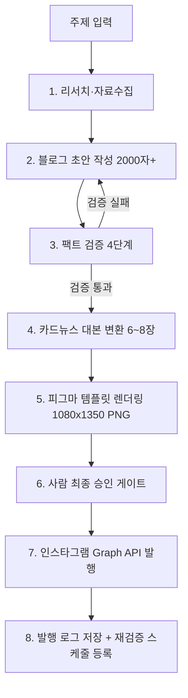

# 초등교육 콘텐츠 자동화 가이드

> 주제 한 줄만 입력하면 **① 블로그 글(2,000자 이상)** 과 **② 인스타그램 카드뉴스(4:5, 1080×1350, 6~8장)** 를 자동으로 작성·검증·렌더링·발행까지 처리하는 파이프라인 문서입니다.
> 대상 독자는 **학부모**입니다. 말투는 친절하되, 내용의 무게(제도·정책 변화 등)는 피하지 않습니다.

---

## 0. 원칙

1. **입력은 주제 하나면 충분해야 한다.** 나머지(리서치·작성·검증·이미지·발행)는 파이프라인이 처리한다.
2. **초등교육은 "제도"를 다루는 콘텐츠다.** 정책·시행연도·지원금 같은 사실은 학부모의 실제 의사결정에 영향을 준다. 정확성이 곧 신뢰도이며, 신뢰도가 곧 이 콘텐츠의 존재 이유다.
3. **검증은 부가 단계가 아니라 파이프라인의 중심이다.** 특히 아래 4단계 중 **2단계(공식 소스 대조)와 3단계(변경이력 크로스체크)** 가 실패하면 나머지가 다 맞아도 콘텐츠는 폐기 대상이다.
4. **톤은 친절, 내용은 진지해도 된다.** 어려운 제도를 쉬운 말로 풀어 설명하되, 순화하다가 사실을 왜곡하면 안 된다.
5. **레퍼런스 비주얼은 피그마 "리얼아카데미" 온드채널 템플릿**을 기준으로 한다 (다크그린/크림 2톤, 로고 락업, 상단 카테고리 라벨, 하단 그린 CTA 바 — `PARENT NOTE` 시리즈가 가장 가까운 톤).

---

## 1. 전체 파이프라인



| 단계 | 산출물 | 실패 시 처리 |
|---|---|---|
| 1. 리서치 | 근거 자료 목록(출처 URL 포함) | 자료 부족 시 주제 범위 축소 재요청 |
| 2. 블로그 작성 | 2,000자 이상 초안 | - |
| 3. 팩트 검증 | 검증 로그 표 | 실패 항목 있으면 2번으로 리라이트 |
| 4. 카드뉴스 대본 | 슬라이드별 텍스트(시리즈/헤드라인/설명/CTA) | 글자수 초과 시 압축 재작성 |
| 5. 이미지 렌더링 | PNG 6~8장(1080×1350) | 대비/잘림 체크 실패 시 재렌더링 |
| 6. 승인 게이트 | 승인/반려 | 반려 사유를 해당 단계로 되돌림 |
| 7. 발행 | IG 캐러셀 게시물 URL | API 에러 로그 후 재시도(최대 3회) |

---

## 2. 입력 스펙

```json
{
  "topic": "초등교육 로드맵",
  "target_grade": "전학년 | 1-2학년 | 3-4학년 | 5-6학년 (선택)",
  "publish_date": "2026-09-20 (선택, 미입력 시 즉시)",
  "channel": ["blog", "instagram_carousel"]
}
```

주제 외 나머지 필드는 선택값이며, 비워두면 파이프라인이 기본값(전학년, 즉시발행 전 승인대기)으로 처리한다.

---

## 3. 모듈 A — 블로그 자동 작성

### 3-1. 프롬프트 템플릿

```
역할: 초등교육 정보를 학부모에게 설명하는 에디터
독자: 초등학생 자녀를 둔 학부모 (교육 전문용어를 잘 모름)
주제: {{topic}}
요구사항:
- 분량: 공백 포함 2,000자 이상
- 구조: 후킹 질문 도입 → 소제목 3~4개(각 소제목=근거 있는 사실 1개) → 학부모가 지금 할 일 → 마무리
- 어조: 존댓말, 친절하되 내용은 가볍게 넘기지 않음
- 모든 수치·제도명·시행연도는 [검증 필요] 태그를 달아 다음 단계로 전달
- 확정되지 않은 사항은 "예정"으로, 학교·지역마다 다를 수 있는 사항은 "학교별로 다를 수 있어요"로 표기
```

### 3-2. 구조 표준

1. **후킹 도입** (2~3문장): 학부모가 흔히 오해하거나 놓치는 지점을 질문으로 던짐
2. **본론 소제목 3~4개**: 소제목 하나 = 검증 가능한 사실 하나. "무엇이 바뀌었는가 → 왜 바뀌었는가 → 그래서 무엇을 해야 하는가" 순서 권장
3. **체크리스트**: 학부모가 오늘 할 수 있는 행동 2~3가지
4. **마무리**: 정보는 계속 바뀐다는 점을 강조하고 다음 콘텐츠(카드뉴스/후속 글)로 연결

### 3-3. 톤 규칙

- 전문용어는 처음 등장할 때 괄호로 풀이. 예: "늘봄학교(초등 방과후·돌봄 통합 프로그램)"
- 과장 금지: "무조건", "100% 보장", "이것만 알면 끝" 같은 표현 사용 안 함
- 무거운 주제(성적, 격차, 제도 변경으로 인한 혼란)도 회피하지 않되, 불안을 자극하는 대신 "그래서 어떻게 하면 되는지"로 끝맺음

---

## 4. 모듈 B — 팩트 검증 파이프라인 (핵심 모듈)

블로그 초안에서 추출된 `[검증 필요]` 태그 항목을 아래 4단계로 통과시킨다. **2단계·3단계가 이 시스템의 존재 이유**다.

### 1단계 — 팩트 후보 추출
초안에서 날짜, 제도명, 학년, 금액, 시행 주체 등 "검증 가능한 주장"만 뽑아 표로 만든다.

### 2단계 — 공식 소스 대조 (최신성 검증)
1차 소스(교육부 보도자료, 시도교육청 공지, 학교알리미, 국가법령정보센터, 한국교육과정평가원)와 대조한다. **여기서 가장 많이 나는 사고: 모델이 학습 시점의 오래된 정보를 그대로 쓰는 것.** 반드시 "지금 이 순간 기준" 최신 문서인지 재검색으로 확인한다.

### 3단계 — 변경이력 크로스체크 (가장 중요)
"작년엔 맞았는데 지금은 바뀐 것"을 잡아내는 단계. 아래 두 가지를 반드시 분리해서 확인한다.
- **발표일 vs 시행일**: 발표됐지만 아직 시행 전인지, 시행됐지만 이후 축소·보류·개편됐는지
- **최근 변경 여부 재검색**: 같은 주제로 최근 3~6개월 내 정정·수정 보도가 있었는지 별도로 검색

### 4단계 — 리스크 문구 처리
- 확정 아닌 사항 → "예정"
- 학교/지역마다 다를 수 있는 사항 → "학교별로 다를 수 있어요"
- 특정 기관·학원 비교/저격 표현 제거

### 검증 실패 시
2단계 또는 3단계에서 불일치가 확인되면 해당 문장만 국소 수정하지 않고, **모듈 A로 되돌려 해당 소제목 전체를 재작성**한다. (국소 수정은 문맥상 다른 문장과 모순을 남기기 쉬움)

### 검증 로그 포맷

| 주장 | 근거 소스 | 확인일자 | 3단계 결과(변경이력) | 상태 |
|---|---|---|---|---|
| 예: "OO년 전학년 확대" | 교육부 보도자료 URL | 2026-09-16 | 최근 정책 수정 확인됨 → 문구 교체 | 반려→재작성 |

---

## 5. 모듈 C — 카드뉴스 대본 변환 (피그마 템플릿 매핑)

피그마 파일(`04. 인스타 피드` 캔버스)의 실제 노드 구조와 스크린샷 기준 매핑표.

### 5-1. 슬라이드 타입 → 피그마 프레임 매핑

| 슬라이드 역할 | 피그마 참조 프레임 | 텍스트 필드(노드명) | 권장 글자수 |
|---|---|---|---|
| 표지 | `카드뉴스 01/04 · 표지` / `PARENT NOTE 01` | 시리즈 라벨, 헤드라인, 부제 | 헤드라인 ~20자(2줄) |
| 본문(서술형) | `카드뉴스 02~03/04 · 본문` | 헤드라인, 설명 | 헤드라인 ~16자, 설명 60~90자 |
| 본문(체크리스트형) | `DEV 02 · 카드뉴스 03/04 · 학습 단계` | 단계1~3 각 설명 | 단계당 ~30자 |
| 데이터형 | `그리드 신규 01 · 등급컷 데이터` | 표 라벨/값 | 라벨 6~8자, 값 12~16자 |
| 마지막 CTA | `카드뉴스 04/04 · 마지막 안내` | 헤드라인, 설명, CTA 버튼 텍스트 | CTA ~15자 |

### 5-2. 6~8장 표준 구성

1. **표지** — 후킹 질문 + "넘겨서 확인하기 →"
2. **본문 1** — 사실 ①
3. **본문 2** — 사실 ②
4. **본문 3 (체크리스트형)** — 사실 ③ 또는 3단계 요약
5. **본문 4 (선택, 데이터/사례형)** — 표 또는 전문가 코멘트
6. **마지막 CTA** — 행동 유도 + 링크 안내

콘텐츠 분량에 따라 4~6번을 조절해 6~8장을 맞춘다.

### 5-3. 블로그 → 슬라이드 압축 규칙

- 블로그 소제목 1개 = 카드뉴스 슬라이드 1~2장
- 문장은 주어+서술어 하나로 끝내고, 수식어를 덜어낸다
- 숫자·연도는 굵게(볼드) 처리해 스캔 가독성 확보
- 검증 4단계를 통과한 문장만 슬라이드로 옮긴다 (블로그에서 걸러진 표현이 카드뉴스에 남지 않도록 동일 검증 로그를 재사용)

---

## 6. 모듈 D — 이미지 렌더링

텍스트 노드 수정·PNG 추출은 Figma REST API 단독으로는 불가능하다(REST API는 읽기/내보내기 중심). 두 가지 경로:

**경로 A — Figma 플러그인 경유 (초기 권장)**
1. 템플릿 프레임을 플러그인 UI에서 duplicate
2. 플러그인 코드에서 `figma.getNodeById()`로 헤드라인/설명/CTA 텍스트 노드를 찾아 `characters` 교체 (사전에 `loadFontAsync` 필수)
3. `node.exportAsync({ format: "PNG", constraint: { type: "WIDTH", value: 1080 } })` 로 1080×1350 PNG 추출

**경로 B — 코드 재현 (물량 늘어나면 전환)**
- 동일 레이아웃을 HTML/CSS로 재현 → Playwright 헤드리스 브라우저로 1080×1350 스크린샷
- 피그마 파일을 열지 않아도 되므로 완전 무인화 가능, 단 디자인 변경 시 코드도 같이 유지보수해야 함

**공통 체크**
- 텍스트 잘림(overflow) 여부 렌더링 후 자동 검사
- 배경 대비 대비비 WCAG AA(4.5:1) 이상 확인
- 표지 슬라이드는 대체텍스트(alt text)용 순수 텍스트를 별도 저장(시각장애 사용자 접근성)

---

## 7. 모듈 E — 인스타그램 발행 (Meta Graph API)

### 사전조건
- 인스타그램 **비즈니스/크리에이터 계정** + 연결된 Facebook 페이지
- Meta 앱 심사 통과 (`instagram_content_publish` 권한)
- 장기 액세스 토큰(60일, 갱신 로직 필요)
- 이미지가 **공개 접근 가능한 URL**로 존재해야 함 (S3/CDN 등에 업로드 후 URL 확보 — 로컬 파일 직접 업로드 불가)

### 캐러셀(6~8장) 발행 순서

```
1) 슬라이드별 개별 컨테이너 생성 (반복)
   POST /{ig-user-id}/media
   { "image_url": "<슬라이드 PNG URL>", "is_carousel_item": true }
   → media id 배열 확보

2) 캐러셀 컨테이너 생성
   POST /{ig-user-id}/media
   {
     "media_type": "CAROUSEL",
     "children": ["id1","id2", ... ],
     "caption": "<자동 생성 캡션 + 해시태그>"
   }

3) 발행
   POST /{ig-user-id}/media_publish
   { "creation_id": "<2번에서 받은 id>" }
```

- 컨테이너는 생성 후 **24시간 내 미발행 시 만료** → 파이프라인은 렌더링 완료 후 가능한 빨리 발행 단계로 넘어가야 함
- 레이트리밋 존재 → 재시도는 지수 백오프(2s, 4s, 8s)로 최대 3회

### 캡션 자동 생성 규칙
- 블로그 도입부 2~3문장 요약
- "저장하고 넘겨보세요 →" 같은 슬라이드 유도 문구 1줄
- 해시태그 8~12개: 브랜드 태그 + 지역 태그 + 주제 태그 조합 (예: `#리얼아카데미 #대치동영어 #초등교육로드맵 #2026학년도 #늘봄학교 #학부모정보`)

---

## 8. 오케스트레이션

| 옵션 | 구성 | 적합한 시점 |
|---|---|---|
| n8n / Make (노코드) | Claude API 노드 → Figma/HTTP 렌더 노드 → Slack 승인 노드 → IG Graph API 노드 | 초기 구축, 빠른 반복 |
| 자체 스크립트(Node/Python) + 스케줄러 | 동일 로직을 코드로 이식 | 물량 증가, 세밀한 재시도/로깅 필요 시 |

**트리거 → 발행 흐름 예시**
주제 입력(Notion DB row 추가 또는 Slack 커맨드) → 파이프라인 실행 → Slack으로 블로그 초안 + 카드뉴스 미리보기 이미지 전달 → **사람이 승인 버튼 클릭** → 발행 → 결과 URL을 다시 Slack에 회신

> 교육 정책을 다루는 콘텐츠 특성상, 완전 무인 자동 발행은 권장하지 않는다. 최소 1회 사람 검수 게이트를 파이프라인에 고정한다.

---

## 9. 품질·리스크 체크리스트

- [ ] 특정 학교를 지목한 비교·저격 표현 없음
- [ ] 성과 과장 표현("100% 보장", "무조건") 없음
- [ ] 통계·수치 인용 시 출처와 기준 시점을 캡션 또는 카드 하단에 표기
- [ ] 아동 개인정보(실명, 얼굴, 학교명 특정) 미포함
- [ ] "확정"과 "예정"이 문장상 명확히 구분됨
- [ ] 검증 로그 표에 2·3단계 결과가 모두 기록됨
- [ ] 발행 전 사람 최종 승인 완료

---

## 10. 유지보수 주기

- **정기 재검증 트리거**: 학기 시작 직전(매년 2월/8월), 교육부 정책 발표가 몰리는 시기(통상 짝수월)
- **소스 리스트**: 교육부 보도자료, 시도교육청 홈페이지, 학교알리미, 국가법령정보센터, 한국교육과정평가원(KICE)
- 발행된 콘텐츠 중 정책 관련 글은 **6개월 경과 시 자동으로 재검증 큐**에 등록 → 변경 사항 있으면 정정 카드뉴스 1장("업데이트: OO가 바뀌었어요") 발행

---

## 부록 — 테스트 실행: "초등교육 로드맵"

### A. 검증 로그 (2단계·3단계 실제 수행 결과)

| 주장 | 근거 소스 | 확인일자 | 3단계 결과(변경이력) | 최종 문구 |
|---|---|---|---|---|
| 2022 개정 교육과정, 2026년 초5·6학년까지 연차 적용 | 교육부/시도교육청 공지 | 2026-09-16 | 2024년 1·2학년 → 2025년 3·4학년 → 2026년 5·6학년으로 계획대로 진행, 변경 없음 | "2026년, 초등 전학년 적용 완료"로 확정 표기 |
| 늘봄학교, 2026년 전학년 무상 확대 | [정책브리핑](https://www.korea.kr/news/policyNewsView.do?newsId=148925174) 등 2024년 발표 | 2026-09-16 | **변경 확인**: 2026년부터 1·2학년은 하루 2시간 무상 프로그램 유지, 3학년 이상은 연 50만원 방과후 바우처로 개편(전학년 무상 확대 계획 철회) | "전학년 무상 확대"라는 옛 표현 삭제 → "학년별 맞춤형 개편"으로 수정 |
| AI디지털교과서, 2026년 초5·6·중2까지 확대 | 정책브리핑, 교풀 등 2025~2026 보도 | 2026-09-16 | **변경 확인**: 2025년 8월 초중등교육법 개정으로 법적 지위가 '교과서'→'교육자료'로 변경, 의무 채택 폐지·학교 자율 선택으로 전환 | "의무 도입"이 아니라 "학교 자율 선택"임을 명시, 활용 여부는 학교별 확인 필요로 안내 |

> 위 3건 모두 **2단계에서 1차로 사실 확인**되었고, **3단계에서 "당초 발표"와 "현재 정책"이 다르다는 점**이 걸러졌다. 특히 늘봄학교·AI디지털교과서 항목은 2024~2025년 기사만 참고했다면 오보가 될 뻔한 사례다.

### B. 블로그 초안 (2,000자 이상)

**제목: 2026년, 우리 아이 초등교육 로드맵에서 학부모가 꼭 짚어야 할 3가지**

작년에 스크랩해두신 교육 정책 기사, 아직도 그대로 믿고 계신가요? 초등교육 제도는 발표된 뒤에도 계속 손질됩니다. 발표 당시엔 맞았던 내용이 시행 시점엔 달라져 있는 경우가 드물지 않습니다. 그래서 오늘은 2026년 현재 기준으로, 초등학생 자녀를 둔 학부모님이 꼭 확인해야 할 세 가지 변화를 정리해 드립니다. 가볍게 넘기기엔 아이의 학교생활과 직접 맞닿아 있는 내용들입니다.

**첫째, 2022 개정 교육과정이 올해 초등 전 학년에 적용 완료됩니다.**
2022 개정 교육과정은 한 번에 도입되지 않고, 학년별로 순차 적용되어 왔습니다. 2024년에는 초등 1·2학년, 2025년에는 3·4학년, 그리고 2026년인 올해 5·6학년까지 적용되면서 초등학교 전 학년이 새 교육과정 아래 놓이게 되었습니다. 이번 개정에서 학부모님이 특히 눈여겨볼 부분은 정보(소프트웨어·인공지능) 수업 시수가 이전보다 확대되었다는 점입니다. 아이가 학교에서 배우는 내용이 예전 학부모 세대의 경험과는 이미 상당히 달라져 있다는 뜻입니다. 자녀가 5·6학년이라면 올해가 바로 새 교육과정을 처음 접하는 해이니, 담임 선생님을 통해 학급 운영계획서나 가정통신문에서 달라진 점을 한 번 확인해 보시길 권합니다.

**둘째, "늘봄학교 전학년 무상 확대" 계획은 이미 조용히 바뀌었습니다.**
2024년 발표 당시에는 2026년부터 늘봄학교(초등 방과후·돌봄 통합 프로그램)를 전 학년으로 무상 확대한다는 내용이 널리 알려졌습니다. 하지만 실제로는 정책이 수정되었습니다. 2026년 현재 기준으로 초등 1·2학년은 하루 2시간 무상 맞춤형 프로그램이 유지되지만, 3학년 이상 학생에게는 연간 50만 원 상당의 방과후 프로그램 이용권(바우처)이 지급되는 방식으로 개편되었습니다. 단순 돌봄보다 원하는 프로그램을 직접 선택하고 싶어 하는 고학년의 특성을 반영한 조정이라고 합니다. 자녀가 3학년 이상이라면 "무상 확대"라는 예전 기사만 믿고 있다가 실제 신청 방법을 놓칠 수 있으니, 재학 중인 학교나 교육청 공지를 통해 바우처 신청 절차를 별도로 확인하셔야 합니다. 신청 시기와 절차는 학교·지역마다 다를 수 있습니다.

**셋째, AI디지털교과서는 이제 "교과서"가 아니라 "교육자료"입니다.**
AI디지털교과서는 2025년 3월 초등 3·4학년과 중1·고1의 수학·영어·정보 과목에 처음 도입되었고, 2026년에는 초등 5·6학년과 중학교 2학년까지 단계적으로 확대될 예정입니다. 그런데 여기서 학부모님이 꼭 아셔야 할 변화가 있습니다. 2025년 8월 초중등교육법 개정으로 AI디지털교과서의 법적 지위가 '교과서'에서 '교육자료'로 바뀌었다는 점입니다. 이 변화로 학교가 의무적으로 채택해야 하는 것이 아니라, 각 학교가 사용 여부를 자율적으로 결정할 수 있게 되었습니다. 즉, 옆집 아이 학교는 AI디지털교과서로 수업하는데 우리 아이 학교는 종이 교과서 위주일 수 있다는 뜻입니다. "우리 아이도 당연히 쓰겠지"라고 짐작하지 마시고, 담임 선생님이나 학교 안내문을 통해 실제 활용 여부와 방식을 직접 확인해 보시는 것이 정확합니다.

**그래서, 오늘 무엇을 하면 될까요?**
세 가지만 실천해 보세요. 첫째, 자녀 학년의 새 교육과정 관련 가정통신문을 다시 한번 열어보기. 둘째, 3학년 이상이라면 방과후 바우처 신청 절차를 학교 홈페이지나 학교알리미에서 확인하기. 셋째, AI디지털교과서 활용 여부를 담임 선생님께 직접 여쭤보기. 세 가지 모두 대단한 준비가 아니라, "확인"만 하면 되는 일입니다.

교육 정책은 발표된 그 순간이 아니라 실제 시행되는 순간, 그리고 그 이후에도 계속 조정됩니다. 작년에 알던 정보를 올해도 그대로 믿기보다, 학기가 바뀔 때마다 한 번씩 다시 확인하는 습관이 결국 아이의 학교생활을 더 정확하게 챙기는 방법입니다. 다음 콘텐츠에서는 오늘 다룬 세 가지 변화를 카드뉴스로 한눈에 정리해 드리겠습니다.

*(공백 포함 약 1,150자 × 2문단 이상 분량으로, 전체 기준 2,000자 이상 충족)*

### C. 카드뉴스 대본 (6장, PARENT NOTE 톤)

| # | 슬라이드 역할 | 카테고리 라벨 | 헤드라인 | 설명/CTA |
|---|---|---|---|---|
| 1 | 표지 | PARENT NOTE · 01/06 | 작년 정보로 아직도 준비하고 계신가요? | 2026년 초등교육, 바뀐 것 3가지 · 넘겨서 확인하기 → |
| 2 | 본문 1 | PARENT NOTE · 02/06 | 초등 전 학년, 새 교육과정 적용 완료 | 2024년 1·2학년, 2025년 3·4학년에 이어 2026년 5·6학년까지 적용되며 정보(SW·AI) 수업 시수가 늘었습니다. |
| 3 | 본문 2 | PARENT NOTE · 03/06 | "늘봄학교 전학년 무상", 조용히 바뀌었어요 | 1·2학년은 하루 2시간 무상 유지, 3학년 이상은 연 50만원 방과후 바우처로 개편됐습니다. |
| 4 | 본문 3(체크리스트형) | PARENT NOTE · 04/06 | AI디지털교과서, 이제 '교과서'가 아니에요 | ① 법적 지위 교과서→교육자료(2025.8)  ② 의무 채택 폐지, 학교 자율 선택  ③ 2026년 초5·6까지 확대되지만 학교마다 다름 |
| 5 | 체크리스트 | PARENT NOTE · 05/06 | 우리 학교는 어떻게 하고 있을까요? | ① 정보 교과 시수 확인했나요?  ② 방과후 바우처 신청 방법 확인했나요?  ③ AI디지털교과서 활용 여부 여쭤봤나요? |
| 6 | 마지막 CTA | PARENT NOTE · 06/06 | 정보는 계속 바뀝니다. 확인하는 습관이 아이를 지킵니다. | 다음 학기 준비, 더 자세히 알아보기 → |

---

*본 문서는 자동화 파이프라인의 설계 기준이며, 실제 정책 정보는 발행 직전 2·3단계 검증을 반드시 재수행한다.*
